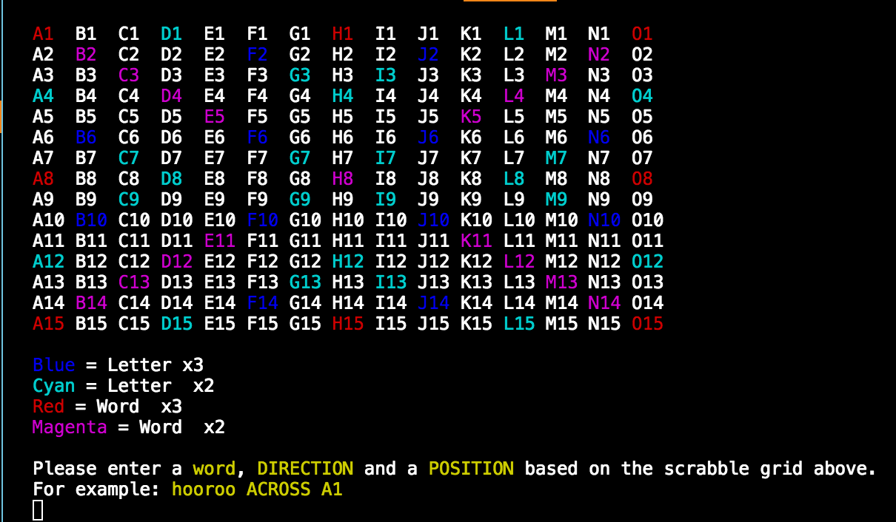

### Motivation
As a dedicated scrabble player myself I decided to give the user the ability to score a word by the letter values and an actual Scrabble 15 x 15 grid like the one below.


This is represented visually using the tty toolkit.



### Functionality
To initiate a game from root directory
```cd lib``` <br>
```ruby gamePrompt```

```Score Word``` will let the user input a word and a score will be returned based on scores for each letter in the word.
e.g.
```cabbage => 14```

In ```Score word with Scrabble grid``` the user inputs a word, a direction(across, down) and a starting position(A1).
This will allow the word to be scored with any multipliers the word should accrue based on a official Scrabble grid.
